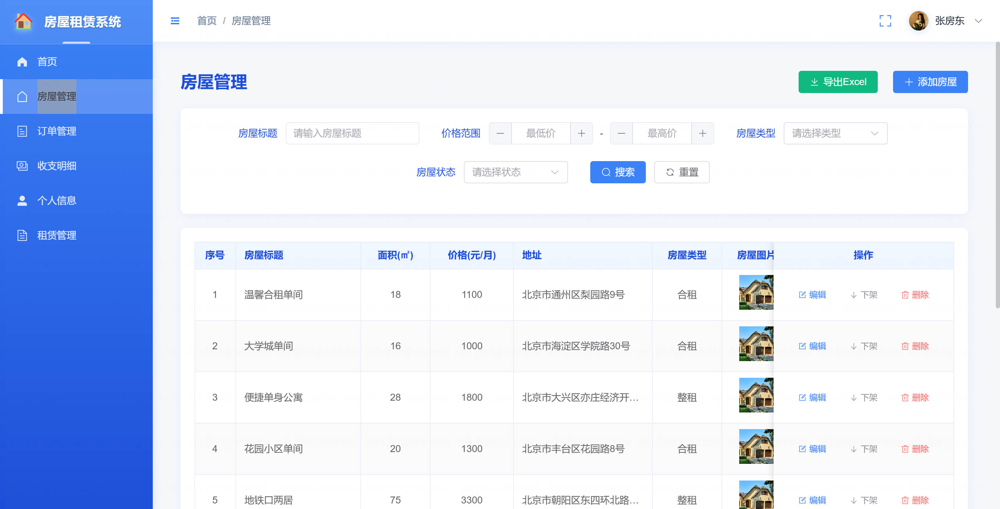
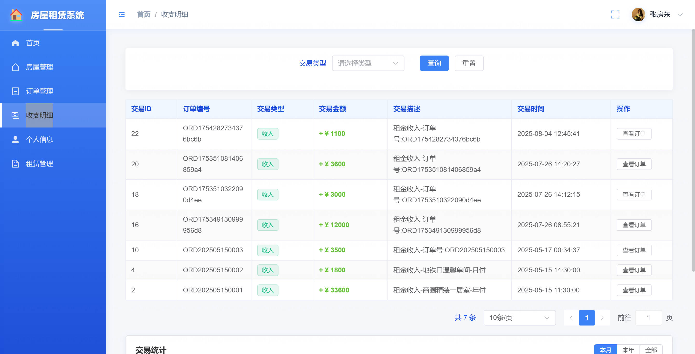
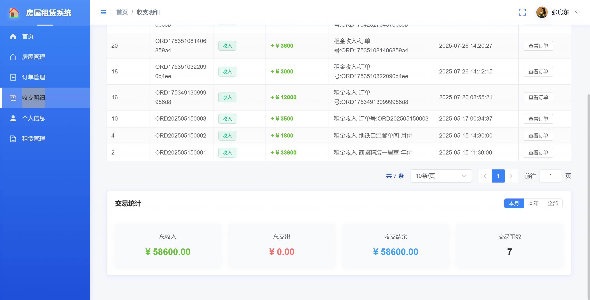
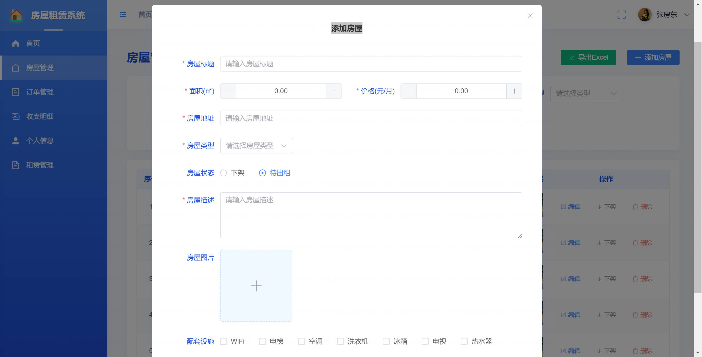
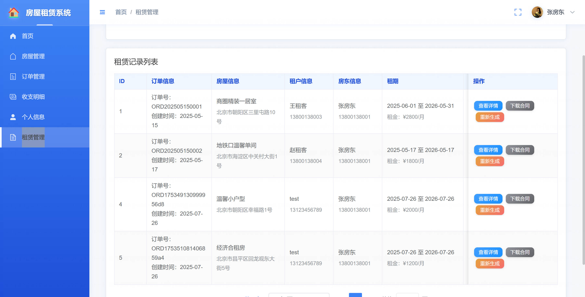
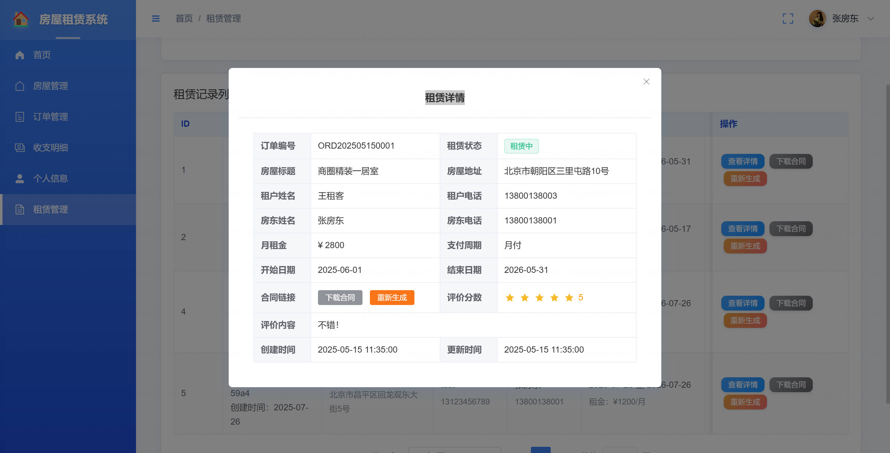
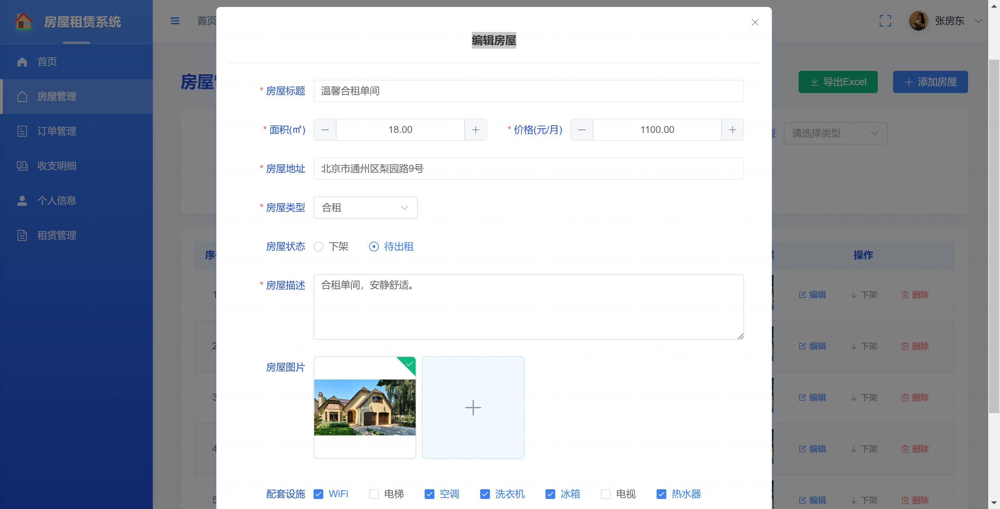
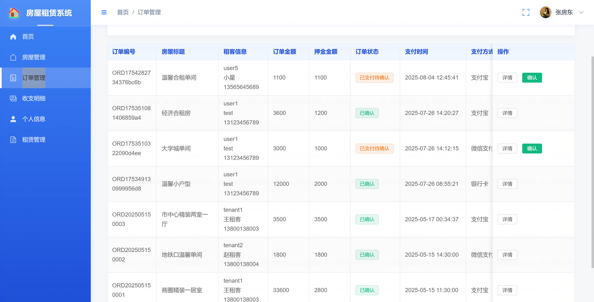
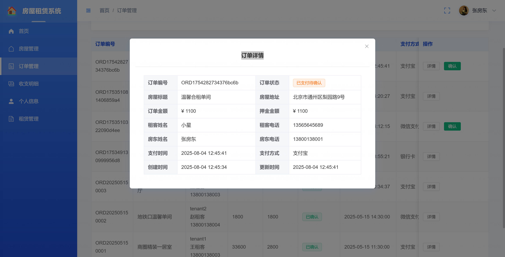
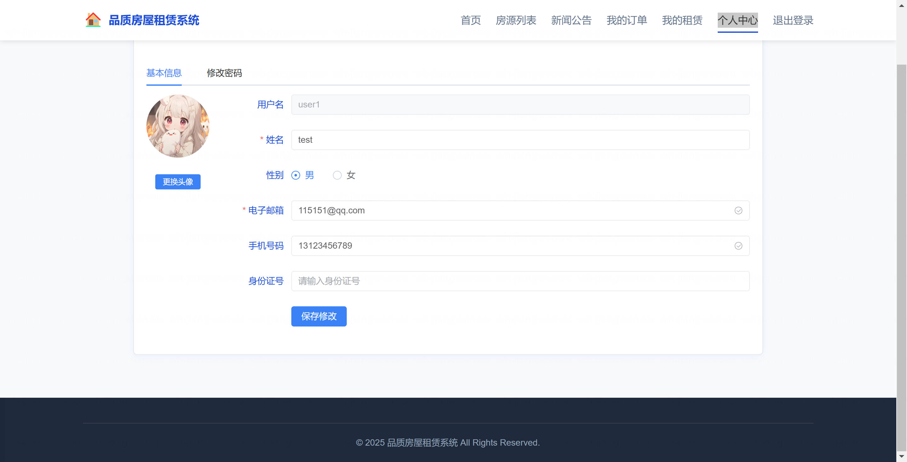

<h1 align="center">基于SpringBoot+Vue3的房屋租赁系统系统</h1>

- <b>完整代码获取地址：从戎源码网 ([https://armycodes.com/](https://armycodes.com/))</b>
- <b>技术探讨、资料分享，请加QQ群：692619798</b>
- <b>作者微信：19941326836  QQ：3645296857</b>
- <b>承接计算机毕业设计、Java毕业设计、Python毕业设计、深度学习、机器学习</b>
- <b>选题+开题报告+任务书+程序定制+安装调试+论文+答辩ppt 一条龙服务</b>
- <b>所有选题地址 ([https://github.com/Descartes007/allProject](https://github.com/Descartes007/allProject)) </b>

## 一、项目介绍

### 基于SpringBoot+Vue3的房屋租赁系统，系统角色为管理员、房东和租客，主要功能如下
### 管理员：
- 基本操作：登录、修改密码、获取个人信息、修改个人信息
- 公告管理：获取公告列表、查看公告详情、发布公告、更新公告、删除公告、修改公告状态
- 轮播图管理：分页获取轮播图、查看轮播图详情、新增轮播图、更新轮播图、删除轮播图、修改轮播图状态
- 房屋类型管理：分页查询、获取全部类型、查看类型详情、新增类型、更新类型、删除类型
- 房屋管理：分页查询房屋、查看房屋详情、新增房屋、更新房屋信息、修改房屋状态、删除房屋
- 订单管理：获取全部订单、查看订单详情
- 租赁记录管理：分页查询租赁记录、查看租赁记录详情、按订单查看记录、生成租赁合同、下载租赁合同
- 交易记录管理：获取全部交易记录、查看交易详情
- 用户管理：分页查询用户、按角色查询、查看用户详情、新增用户、更新用户信息、根据ID删除用户、修改用户状态、按用户名查询
- 文件管理：上传图片
- 邮件服务：发送邮箱验证码、按邮箱查询用户
- 统计分析：仪表盘统计、最近租赁记录、月度订单统计、房源类型分布
- 房东：
- 基本操作：登录、修改密码、获取个人信息、修改个人信息
- 公告管理：获取公告列表、查看公告详情
- 轮播图管理：查看启用的轮播图
- 房屋管理：获取名下房屋列表、查看房屋详情、新增房屋、更新房屋信息、修改房屋状态、删除房屋
- 订单管理：获取名下订单、查看订单详情、确认订单、取消订单
- 租赁记录管理：分页查询租赁记录、查看租赁记录详情、按订单查看记录、下载租赁合同
- 交易记录管理：查看本人交易记录
- 文件管理：上传图片、批量上传图片
- 租客：
- 基本操作：登录、修改密码、获取个人信息、修改个人信息、忘记密码（邮箱验证码）
- 公告管理：获取公告列表、查看公告详情
- 轮播图管理：查看启用的轮播图
- 房屋管理：分页浏览房源、查看房屋详情
- 订单管理：创建订单、支付订单、取消订单、申请退款、查看订单详情、获取本人订单
- 租赁记录管理：分页查询本人租赁记录、查看租赁记录详情、提交租赁评价、下载租赁合同
- 交易记录管理：查看本人交易记录
- 文件管理：上传图片

## 二、项目技术

- 编程语言：Java 17
- 项目架构：B/S架构
- 前端技术：Vue 3、Vite、Element Plus、Vue Router、Vuex（含 Pinia 依赖）、Axios、ECharts、Sass、XLSX
- 后端技术：Spring Boot 3.2、Spring Security、MyBatis-Plus、Lombok、Jakarta Mail（Spring Boot Mail）、JWT（auth0 java-jwt）、Hutool、Knife4j OpenAPI 3、Spring AOP、iText（含中文字体包）、Apache PDFBox、Alipay SDK、MySQL 、MySQL

## 三、运行环境

- JDK版本：1.8及以上都可以
- 操作系统：Windows7/10、MacOS
- 开发工具：IDEA、Ecplise、MyEclipse都可以

## 四、数据库配置文件

- npm版本：6.14.13及以上都可以
- Redis版本：3.2.100及以上都可以
- 文件名：application.properties
- 编码类型：utf8

## 论文截图

## 系统截图

